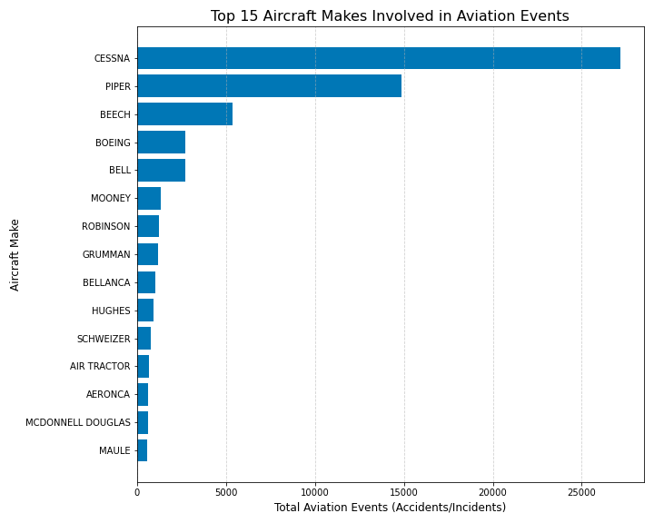

# Analysis of Aircraft Incident Frequencies by Make and Model: Identifying Low-Risk Aircraft for Commercial and Private Operations
## Business problem
Our company is poised to enter the aviation industry by purchasing and managing aircraft for both private and commercial usage, with the goal of expanding its portfolio. Given the inherent dangers associated with aviation, it is imperative to comprehend these risks in order to make well-informed judgments. In order to ensure a safe and successful launch into the market, this project aims to deliver a data-driven examination of aviation safety with a particular focus on finding the lowest-risk aircraft.
### Data understanding
The data used in this project is a dataset from the National Transportation Safety Board that includes aviation accident data from 1962 to 2023 about civil aviation accidents and selected incidents in the United States and international waters.
### Findings
The analysis yielded meaningful insights as can be seen from the following visualizations

